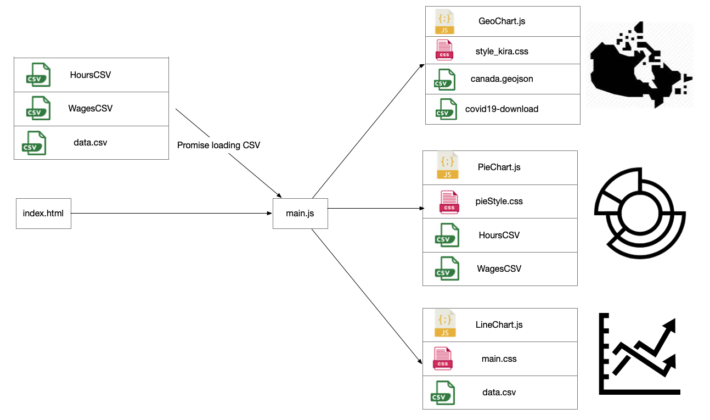

# CPSC 436V Project Team 17

## Over View
Due to the covid-19, many countries imposed tight restrictions on movement to control the spread of the virus. The restrictions bring economic activity to a near-standstill and it affects many people’s lives. Policymakers want to assess how individual economic activity is affected by covid before providing a suitable recovery benefit plan. To address this challenge, we propose building a data visualization that allows policymakers to visually explore a dataset of covid cases, consumer price index, and wage. In our visualization, we aim to assess the changes in wage and consumer price index, as well as other economic activities by comparing different provinces before and after Covid19. 

Our visualization consisted of three Views. View1 (Geography Map) shows the numbers of covid cases in each province. View 2 (Pie Chart) shows the changes in wage and CPI in each industry. View 3 (Line Chart) shows changes in CPI/Income, Income, CPI (before covid & after covid). 

## Team Info
Team Number: 17 

Zexu(Kira) Yan                   58748013

Yang(Larry) Liu       	        26631960

Liangyu(Ricky) Zhu             47535364 

## File Structure

## Best screen size: 
1280px X 800px

## Quick Demo
.gif)

